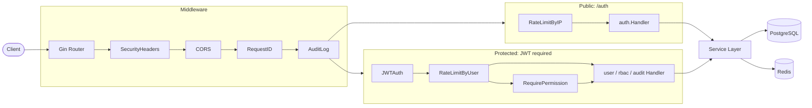

# Security Service

> 基于 Go 的企业级安全服务 — 认证 / RBAC 权限 / 审计日志 / 安全防护，开箱即用。


## 架构总览



> 完整架构图、流程图、ER 图见 [docs/diagrams.md](docs/diagrams.md)，设计决策详见 [ARCHITECTURE.md](ARCHITECTURE.md)。

## 快速启动

```bash
git clone <repo-url> && cd security-service

cp .env.example .env          # 生产环境务必修改 JWT_SECRET

docker-compose up -d           # 启动 API + PostgreSQL + Redis

curl http://localhost:8080/health
# {"code":200,"message":"success","data":{"status":"ok"}}
```

服务默认运行在 `http://localhost:8080`，首次启动自动建表并写入 RBAC 种子数据。

## 接口列表

### 公开接口

| 方法 | 路径 | 说明 | 限流 |
|------|------|------|------|
| `GET` | `/health` | 健康检查 | - |
| `POST` | `/api/v1/auth/register` | 用户注册 | - |
| `POST` | `/api/v1/auth/login` | 用户登录 | 同 IP 5 次/分 |
| `POST` | `/api/v1/auth/refresh` | 刷新 Token | - |
| `POST` | `/api/v1/auth/logout` | 用户登出（传 Bearer Token） | - |

### 需要登录（`Authorization: Bearer <token>`）

| 方法 | 路径 | 说明 | 所需权限 | 限流 |
|------|------|------|----------|------|
| `GET` | `/api/v1/users` | 用户列表 | - | 同用户 30 次/分 |
| `GET` | `/api/v1/users/:id` | 用户详情 | - | 同上 |
| `PUT` | `/api/v1/users/:id` | 更新用户 | - | 同上 |
| `DELETE` | `/api/v1/users/:id` | 删除用户 | - | 同上 |
| `POST` | `/api/v1/roles` | 创建角色 | `role:manage` | 同上 |
| `GET` | `/api/v1/roles` | 角色列表 | `role:manage` | 同上 |
| `POST` | `/api/v1/users/:id/roles` | 给用户分配角色 | `role:manage` | 同上 |
| `GET` | `/api/v1/audit-logs` | 审计日志查询 | `log:read` | 同上 |

**审计日志查询参数**：`user_id`、`risk_level`（`HIGH`/`LOW`）、`start_time`、`end_time`（RFC 3339）、`offset`、`limit`

### 预置角色与权限

| 角色 | 权限 |
|------|------|
| `admin` | `user:create` `user:read` `user:update` `user:delete` `role:manage` `permission:manage` `log:read` `policy:manage` |
| `auditor` | `log:read` |
| `developer` | `user:read` |
| `guest` | 无 |

## 安全设计亮点

### 1. JWT 双 Token + jti 精确吊销

Access Token 15 分钟有效，Refresh Token 7 天有效，每个 Token 携带唯一 `jti`。登出或刷新时将旧 `jti` 写入 Redis 黑名单（TTL = Token 剩余有效期），认证中间件每次请求查 Redis 校验。这样既保留了 JWT 无状态的扩展优势，又实现了按需精确吊销。

### 2. RBAC 权限模型 + Redis 缓存

权限查询走 `user_roles → role_permissions → permissions` 三表 JOIN，结果缓存到 Redis（5 分钟 TTL）。角色变更时主动失效缓存。权限码（如 `user:create`）与角色解耦，新增权限只需数据库操作，无需改代码，满足最小权限原则。

### 3. Redis 滑动窗口限流

基于 Sorted Set 实现真正的滑动窗口，避免固定窗口的边界突发问题。登录接口按 IP 限 5 次/分钟防暴力破解，鉴权接口按 UserID 限 30 次/分钟防滥用。Redis 故障时 fail-open，不影响正常请求。

### 4. 全链路输入校验 + SQL 注入防护

所有 DTO 经过 `Sanitize()`（trim 空格）+ `Validate()`（格式校验）双重处理。用户名仅允许 `[a-zA-Z0-9_]`，密码必须 8-72 位含大小写和数字。全部数据库操作使用 GORM 参数化查询 `Where("col = ?", val)`，从代码层面杜绝 SQL 注入。

### 5. 审计日志 + 风险标记

所有 API 请求自动异步记录，包含 UserID、Method+Path、IP、状态码、风险等级。登录失败（401）和权限拒绝（403）自动标记为 `HIGH` 风险。只记录请求元数据，不记录请求体，从架构层面杜绝密码等敏感信息泄露。

### 6. 纵深防御响应安全

每个响应注入 4 个安全头（`X-Content-Type-Options: nosniff`、`X-Frame-Options: DENY`、`CSP: default-src 'self'`、`Referrer-Policy`）。统一 JSON 响应格式 `{ code, message, data }`，5xx 错误自动替换为 `"internal server error"`，绝不暴露堆栈或内部信息。

## 目录结构

```
security-service/
├── cmd/api/
│   ├── main.go                 程序入口，路由注册，依赖装配
│   └── api_test.go             集成测试（4 个场景）
├── internal/
│   ├── auth/                   认证模块
│   │   ├── handler.go            HTTP 处理器（注册/登录/登出/刷新）
│   │   ├── service.go            业务逻辑（密码校验/Token 签发/黑名单）
│   │   └── dto.go                请求结构体 + Sanitize/Validate
│   ├── user/                   用户模块
│   │   ├── model.go              User GORM 模型（UUID 主键/软删除）
│   │   ├── repository.go         Repository 接口 + GORM 实现
│   │   └── handler.go            用户 CRUD 处理器
│   ├── rbac/                   权限模块
│   │   ├── model.go              Role / Permission / UserRole 模型
│   │   ├── service.go            CheckPermission + Redis 缓存 + Seed
│   │   └── handler.go            角色管理 + 角色分配处理器
│   ├── audit/                  审计模块
│   │   ├── model.go              审计日志模型（含 risk_level）
│   │   ├── service.go            Record + ListWithFilter
│   │   └── handler.go            审计日志查询处理器
│   ├── middleware/             中间件
│   │   ├── auth.go               JWT 鉴权 + 黑名单校验
│   │   ├── rbac.go               RBAC RequirePermission
│   │   ├── audit.go              审计日志（异步写入）
│   │   ├── rate_limit.go         滑动窗口限流（IP / UserID）
│   │   ├── security.go           安全响应头
│   │   ├── cors.go               跨域处理
│   │   └── request_id.go         请求追踪 ID
│   ├── security/               安全工具
│   │   ├── jwt.go                JWTManager（签发/验证/jti）
│   │   └── password.go           bcrypt 哈希/比对
│   ├── store/                  数据层
│   │   ├── db.go                 PostgreSQL + GORM 初始化
│   │   ├── redis.go              Redis 客户端初始化
│   │   └── blacklist.go          Token jti 黑名单（Redis）
│   └── validator/              校验工具
│       └── validator.go          用户名/邮箱/密码格式校验
├── pkg/response/               统一响应
│   └── response.go              OK/Created/BadRequest/.../Error（5xx 自动屏蔽）
├── docs/
│   └── diagrams.md             Mermaid 架构图 / 流程图 / ER 图
├── ARCHITECTURE.md             架构设计文档
├── Dockerfile                  多阶段构建
├── docker-compose.yml          API + PostgreSQL + Redis 编排
├── .env.example                环境变量模板
├── go.mod / go.sum             依赖管理
└── README.md                   本文件
```

## 环境变量

| 变量 | 默认值 | 说明 |
|------|--------|------|
| `PORT` | `8080` | 服务端口 |
| `DB_HOST` | `localhost` | PostgreSQL 主机 |
| `DB_PORT` | `5432` | PostgreSQL 端口 |
| `DB_USER` | `postgres` | PostgreSQL 用户名 |
| `DB_PASSWORD` | `postgres` | PostgreSQL 密码 |
| `DB_NAME` | `security_service` | 数据库名 |
| `DATABASE_URL` | - | 完整连接串（优先于上方分字段配置） |
| `REDIS_ADDR` | `localhost:6379` | Redis 地址 |
| `REDIS_PASSWORD` | - | Redis 密码 |
| `JWT_SECRET` | - | JWT 签名密钥，**生产环境必须设置** |

## 测试

```bash
# 运行全部测试（使用内存 SQLite + miniredis，无需外部依赖）
go test ./... -v

# 仅运行集成测试
go test ./cmd/api/ -v -count=1

# 测试覆盖的场景：
#   TestRegisterDuplicateUsername_Returns400   注册重复用户名 → 400
#   TestLogoutInvalidatesToken                 登出后 Token 失效 → 401
#   TestNoPermission_Returns403                无权限访问 → 403
#   TestLoginRateLimit_Returns429              登录超限 → 429
```
