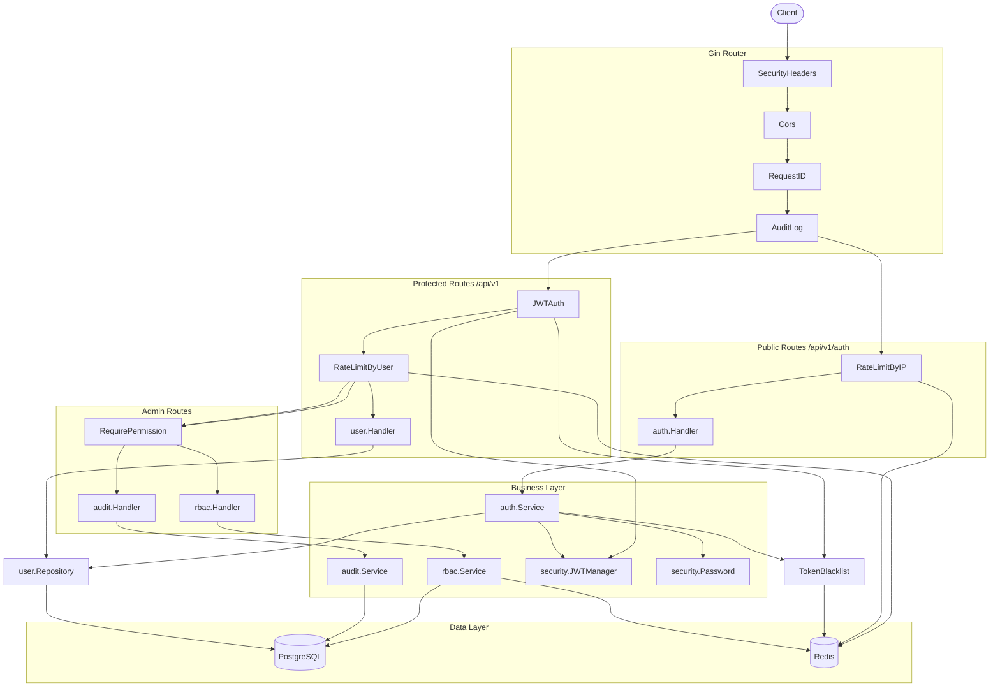
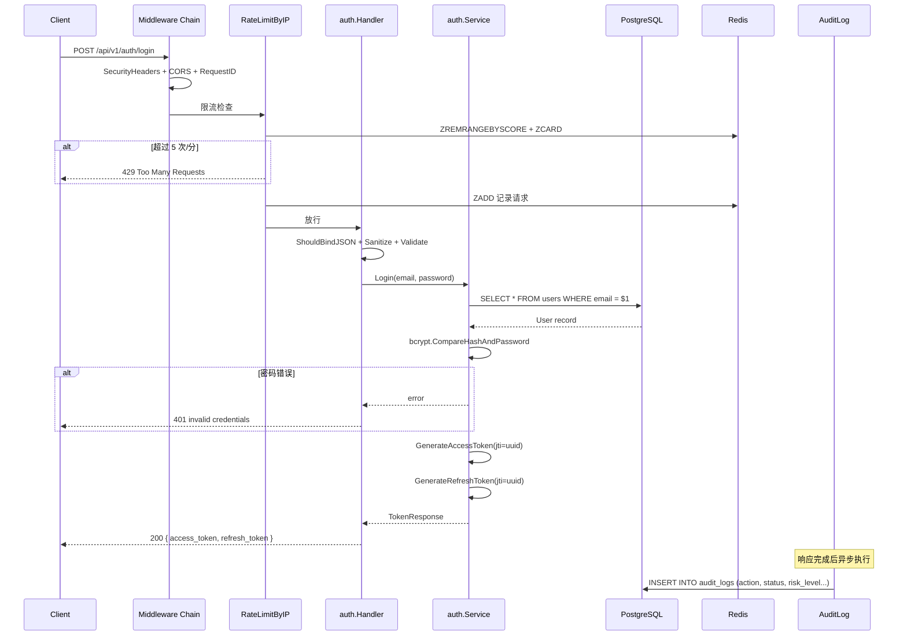
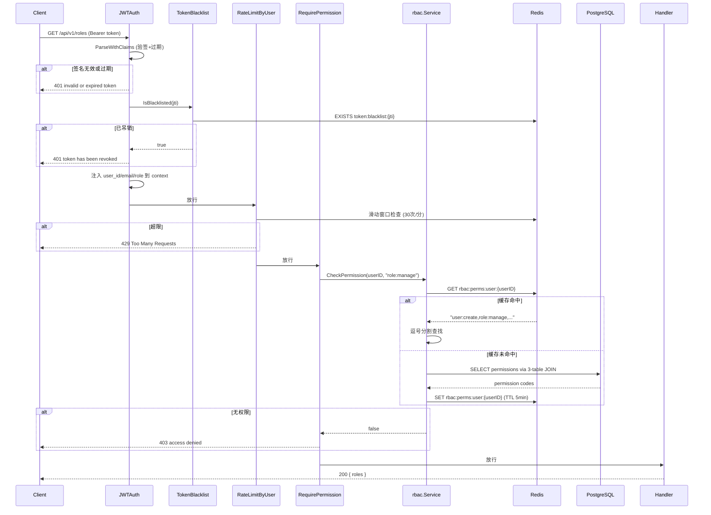
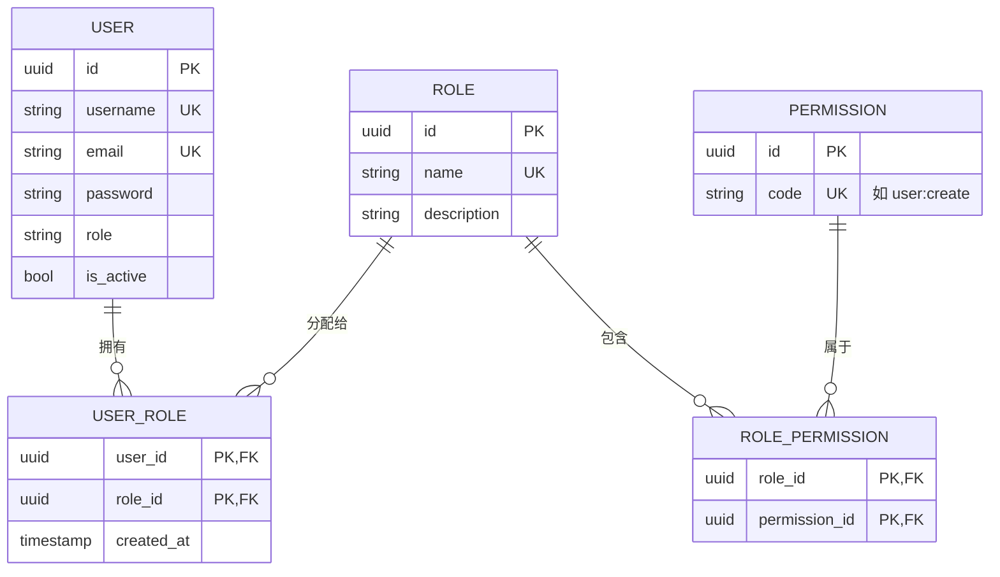
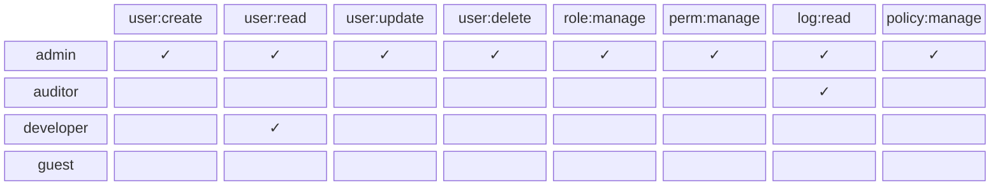
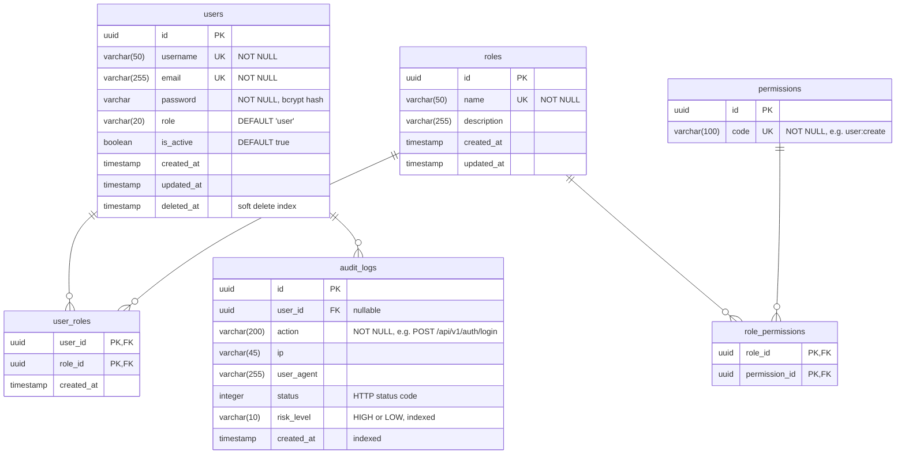

# Architecture Diagrams

## 系统整体架构图

```mermaid
graph TB
    Client([Client])

    subgraph Gateway["Gin Router"]
        SEC[SecurityHeaders]
        CORS[Cors]
        RID[RequestID]
        AUDIT[AuditLog]
    end

    subgraph Public["Public Routes /api/v1/auth"]
        RLIP[RateLimitByIP]
        AUTH_H[auth.Handler]
    end

    subgraph Protected["Protected Routes /api/v1"]
        JWT[JWTAuth]
        RLUSER[RateLimitByUser]
        USER_H[user.Handler]
    end

    subgraph Admin["Admin Routes"]
        RBAC_MW[RequirePermission]
        RBAC_H[rbac.Handler]
        AUDIT_H[audit.Handler]
    end

    subgraph Services["Business Layer"]
        AUTH_S[auth.Service]
        RBAC_S[rbac.Service]
        AUDIT_S[audit.Service]
        SEC_S[security.JWTManager]
        PWD[security.Password]
    end

    subgraph Data["Data Layer"]
        PG[(PostgreSQL)]
        RD[(Redis)]
    end

    Client --> SEC --> CORS --> RID --> AUDIT

    AUDIT --> RLIP --> AUTH_H
    AUDIT --> JWT --> RLUSER --> USER_H
    RLUSER --> RBAC_MW --> RBAC_H
    RLUSER --> RBAC_MW --> AUDIT_H

    AUTH_H --> AUTH_S
    USER_H --> USER_REPO[user.Repository]
    RBAC_H --> RBAC_S
    AUDIT_H --> AUDIT_S

    AUTH_S --> USER_REPO
    AUTH_S --> SEC_S
    AUTH_S --> PWD
    AUTH_S --> BL[TokenBlacklist]

    JWT --> SEC_S
    JWT --> BL

    USER_REPO --> PG
    AUDIT_S --> PG
    RBAC_S --> PG
    RBAC_S --> RD
    BL --> RD
    RLIP --> RD
    RLUSER --> RD
```

## 请求处理流程图

### 登录链路

```mermaid
sequenceDiagram
    participant C as Client
    participant MW as Middleware Chain
    participant RL as RateLimitByIP
    participant H as auth.Handler
    participant S as auth.Service
    participant DB as PostgreSQL
    participant R as Redis
    participant A as AuditLog

    C->>MW: POST /api/v1/auth/login
    MW->>MW: SecurityHeaders + CORS + RequestID
    MW->>RL: 限流检查
    RL->>R: ZREMRANGEBYSCORE + ZCARD
    alt 超过 5 次/分
        RL-->>C: 429 Too Many Requests
    end
    RL->>R: ZADD 记录请求
    RL->>H: 放行

    H->>H: ShouldBindJSON + Sanitize + Validate
    H->>S: Login(email, password)
    S->>DB: SELECT * FROM users WHERE email = $1
    DB-->>S: User record
    S->>S: bcrypt.CompareHashAndPassword
    alt 密码错误
        S-->>H: error
        H-->>C: 401 invalid credentials
    end
    S->>S: GenerateAccessToken(jti=uuid)
    S->>S: GenerateRefreshToken(jti=uuid)
    S-->>H: TokenResponse
    H-->>C: 200 { access_token, refresh_token }

    Note over A: 响应完成后异步执行
    A->>DB: INSERT INTO audit_logs (action, status, risk_level...)
```

### 鉴权链路

```mermaid
sequenceDiagram
    participant C as Client
    participant JWT as JWTAuth
    participant BL as TokenBlacklist
    participant RL as RateLimitByUser
    participant RBAC as RequirePermission
    participant RS as rbac.Service
    participant R as Redis
    participant DB as PostgreSQL
    participant H as Handler

    C->>JWT: GET /api/v1/roles (Bearer token)
    JWT->>JWT: ParseWithClaims (验签+过期)
    alt 签名无效或过期
        JWT-->>C: 401 invalid or expired token
    end
    JWT->>BL: IsBlacklisted(jti)
    BL->>R: EXISTS token:blacklist:{jti}
    alt 已吊销
        BL-->>JWT: true
        JWT-->>C: 401 token has been revoked
    end
    JWT->>JWT: 注入 user_id/email/role 到 context

    JWT->>RL: 放行
    RL->>R: 滑动窗口检查 (30次/分)
    alt 超限
        RL-->>C: 429 Too Many Requests
    end

    RL->>RBAC: 放行
    RBAC->>RS: CheckPermission(userID, "role:manage")
    RS->>R: GET rbac:perms:user:{userID}
    alt 缓存命中
        R-->>RS: "user:create,role:manage,..."
        RS->>RS: 逗号分割查找
    else 缓存未命中
        RS->>DB: SELECT permissions via 3-table JOIN
        DB-->>RS: permission codes
        RS->>R: SET rbac:perms:user:{userID} (TTL 5min)
    end
    alt 无权限
        RS-->>RBAC: false
        RBAC-->>C: 403 access denied
    end

    RBAC->>H: 放行
    H-->>C: 200 { roles }
```

## RBAC 权限模型关系图

```mermaid
erDiagram
    USER ||--o{ USER_ROLE : "拥有"
    ROLE ||--o{ USER_ROLE : "分配给"
    ROLE ||--o{ ROLE_PERMISSION : "包含"
    PERMISSION ||--o{ ROLE_PERMISSION : "属于"

    USER {
        uuid id PK
        string username UK
        string email UK
        string password
        string role
        bool is_active
    }

    ROLE {
        uuid id PK
        string name UK
        string description
    }

    PERMISSION {
        uuid id PK
        string code UK "如 user:create"
    }

    USER_ROLE {
        uuid user_id PK,FK
        uuid role_id PK,FK
        timestamp created_at
    }

    ROLE_PERMISSION {
        uuid role_id PK,FK
        uuid permission_id PK,FK
    }
```

### 预置权限矩阵

```mermaid
block-beta
    columns 9

    space header1["user:create"] header2["user:read"] header3["user:update"] header4["user:delete"] header5["role:manage"] header6["perm:manage"] header7["log:read"] header8["policy:manage"]

    admin["admin"]:1 a1["✓"]:1 a2["✓"]:1 a3["✓"]:1 a4["✓"]:1 a5["✓"]:1 a6["✓"]:1 a7["✓"]:1 a8["✓"]:1
    auditor["auditor"]:1 b1[" "]:1 b2[" "]:1 b3[" "]:1 b4[" "]:1 b5[" "]:1 b6[" "]:1 b7["✓"]:1 b8[" "]:1
    developer["developer"]:1 c1[" "]:1 c2["✓"]:1 c3[" "]:1 c4[" "]:1 c5[" "]:1 c6[" "]:1 c7[" "]:1 c8[" "]:1
    guest["guest"]:1 d1[" "]:1 d2[" "]:1 d3[" "]:1 d4[" "]:1 d5[" "]:1 d6[" "]:1 d7[" "]:1 d8[" "]:1
```

## 数据库 ER 图

```mermaid
erDiagram
    users ||--o{ user_roles : ""
    roles ||--o{ user_roles : ""
    roles ||--o{ role_permissions : ""
    permissions ||--o{ role_permissions : ""
    users ||--o{ audit_logs : ""

    users {
        uuid id PK
        varchar(50) username UK "NOT NULL"
        varchar(255) email UK "NOT NULL"
        varchar password "NOT NULL, bcrypt hash"
        varchar(20) role "DEFAULT 'user'"
        boolean is_active "DEFAULT true"
        timestamp created_at
        timestamp updated_at
        timestamp deleted_at "soft delete index"
    }

    roles {
        uuid id PK
        varchar(50) name UK "NOT NULL"
        varchar(255) description
        timestamp created_at
        timestamp updated_at
    }

    permissions {
        uuid id PK
        varchar(100) code UK "NOT NULL, e.g. user:create"
    }

    user_roles {
        uuid user_id PK,FK
        uuid role_id PK,FK
        timestamp created_at
    }

    role_permissions {
        uuid role_id PK,FK
        uuid permission_id PK,FK
    }

    audit_logs {
        uuid id PK
        uuid user_id FK "nullable"
        varchar(200) action "NOT NULL, e.g. POST /api/v1/auth/login"
        varchar(45) ip
        varchar(255) user_agent
        integer status "HTTP status code"
        varchar(10) risk_level "HIGH or LOW, indexed"
        timestamp created_at "indexed"
    }
```
